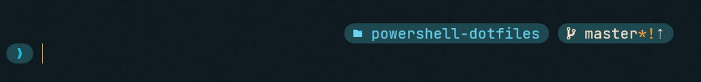

# PowerShell Dotfiles

Simple repository containing files needed to reproduce my Powershell prompt.

___

## Installation

This setup requires/supports the following:

- [Windows Terminal](https://github.com/microsoft/terminal)
  - The theme can be found at `files/seashells.json`
- [Starship Prompt](https://starship.rs/)
  - The configuration can be found at `files/starhsip.toml`
    - Needs to be placed under the `~/.config/` directory on your computer
- [posh-git](https://github.com/dahlbyk/posh-git)
- [Git](https://git-scm.com/)
  - For aliases
- [vcpkg](https://github.com/microsoft/vcpkg)
  - You might need to update the `posh-vcpkg` module path in the profile

Once the above have been installed, simply copy/paste the contents of `files/posh-profile.ps1` into your PowerShell profile (you can find its path using the `$PROFILE` variable).